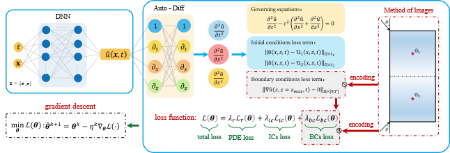
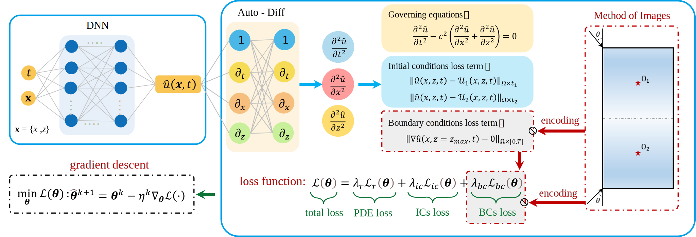

# PENN-SH2d

### What is this repository for?

The demo code for "Physics-enhanced neural networks for half-space seismic wave modeling"

Forward modelling of seismic waves using physics-informed neural networks (PINNs) has attracted much attention. A critical challenge is that these wave propagation problems are typically defined in large domains (i.e., half-space). We have found that PINNs can suffer from the problem of "soft constraint failure" when modeling the propagation of seismic waves in half-space with traction-free conditions on the surface boundary. In this paper, we propose a novel framework called physics-enhanced neural networks (PENNs) to model seismic wave propagation in half-space. In this paper, we analyze the training dynamics of neural networks when solving two-dimensional (2D) SH wave equations from the neural tangent kernel (NTK) perspective. And we introduce an adaptive training algorithm to mitigate the unbalanced gradient flow dynamics of the different components of the loss function of PINNs/PENNs. For the complex behavior of seismic waves in layered media, we consider a sequential training strategy to improve network scalability and solution accuracy. Finally, we perform a series of numerical experiments to verify the correctness of our theory and the practical effectiveness of the proposed algorithms.

### Usage

1. Dependent environment:

+ Pytorch > 1.13
+ SALib
+ scipy
+ numpy
+ matplotlib

2. Run the Code

+ SH_infinite_NTK_xz1500_c600_5Hz: The SH wave propagation in infinite domain.

+ SH_freesurface_x1500z1200_c3000_15Hz_Oz400: cylindrical waves in underground half-space, the source is located at (750m. 400m).

+ SH_freesurface_x1500z1200_c3000_15Hz_Oz700: cylindrical waves in underground half-space, the source is located at (750m. 700m).

---

MIT License

Copyright (c) 2023 norery